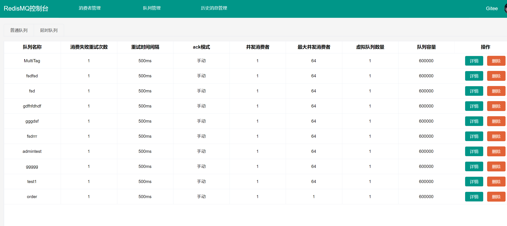

## 什么是 Redis-MQ

Redis-MQ 是利用redis实现mq的功能的中间件

## 特点

- **无侵入延时队列**：无需任何配置和额外的插件即可使用延时队列 
- **兼容spring事务和seata事务**：支持消息在事务提交后发送
- **优雅的api封装**:  对外暴露的api及其简单易用
- **支持消息的负载均衡**：通过redis定时轮询注册心跳
- **支持顺序消息**： 只需要把消费者和虚拟队列都设置为1
- **支持定时消息**： 可以让消息在指定时间执行
- **支持生产者消费者回调**： 消息发送结果通过回调通知用户
- **启动监控控制台**：方便对消息进行监控 -新特性 0.2.0以下版本不支持使使用控制台

##公告
0.2.0有严重bug。不能使用

## 引入  
``` xml
      <dependency>
            <groupId>io.github.zhaohaoh</groupId>
            <artifactId>redismq-spring-boot-starter</artifactId>
            <version>0.3.0</version>
        </dependency>
        <dependency>
            <groupId>io.github.zhaohaoh</groupId>
            <artifactId>redismq-spring-boot3-starter</artifactId>
            <version>0.3.0</version>
        </dependency>
```
## 注意事项
队列名称存储在redis中。如果一个队列无用了。需要去redis控制台中手动删除，否则也没影响，就是占用redis空间。

### 0.2.0以下版本不支持使使用控制台！！！
如需升级，需等所有消息消费完成后升级版本。因为对于redis底层存储数据机制改变。消息序列化会不兼容

## 快速开始

### application.peoperties配置

```properties
#指定环境隔离的分组
spring.redismq.namespace=default
spring.redismq.client.host=localhost
#默认的database
spring.redismq.client.database=6
spring.redismq.client.port=6379
spring.redismq.client.username=你的用户
spring.redismq.client.password=你的密码
#虚拟队列数量默认是1，单机redis配多了没有意义
spring.redismq.virtual=1
#默认值true 事务提交后发送
spring.redismq.global-config.send-after-commit=true
#如果有seata事务需要开启 默认值false
spring.redismq.global-config.seata-state=true
#默认单个队列消息堆积上限值
spring.redismq.global-config.queueMaxSize=100000
```

### 部署redismqAdmin控制台
application.properties  
```properties
server.servlet.context-path=/
#配置当前服务器的名称DynamicRoutingDataSource
spring.application.name=redismq-admin
#解决springboot2.6.3 接口不显示的问题。路径匹配变更了方式
spring.mvc.pathmatch.matching-strategy=ant_path_matcher
spring.jackson.date-format=yyyy-MM-dd HH:mm:ss
spring.jackson.time-zone=GMT+8
//你的端口
server.port=8088
#指定环境隔离的分组
spring.redismq.namespace=你的分组
spring.redismq.client.host=你的redis地址
spring.web.resources.static-locations=classpath:/static/
```
本地启动项目或者部署到服务器均可
# 运行管理界面
nohup java -jar redismq-admin-0.2.0.jar --server.port=8088 --spring.redismq.client.host=你的redis地址 --spring.redismq.namespace=你的分组

随后访问http://localhost:8088

#### 效果展示


### 案例代码

```java
/**
 * @Author: hzh
 * @Date: 2022/12/26 17:54
 * 生产消息的例子
 */
@RestController
@RequestMapping("producer")
public class ProducerController {
    @Autowired
    private RedisMQTemplate redisMQTemplate;

    /**
     * 发送延迟消息
     */
    @PostMapping("sendDelayMessage")
    public void sendDelayMessage() {
        redisMQTemplate.sendDelayMessage("延时消息消费", "delaytest1", Duration.ofSeconds(60));
    }


    /**
     * 发送普通消息
     */
    @PostMapping("sendMessage")
    public void sendMessage() {
        redisMQTemplate.sendMessage("普通消息消费", "test1");
    }

    /**
     * 发送顺序消息
     */
    @PostMapping("sendOrderMessage")
    public void sendOrderMessage() {
        redisMQTemplate.sendMessage("顺序消息消费", "order");
    }

    /**
     * 发送定时消费消息 带tag
     */
    @PostMapping("sendTimingMessage")
    public void sendTimingMessage() {
        LocalDateTime time = LocalDateTime.of(2022, 12, 26, 14, 20, 30);
        long l = time.toInstant(ZoneOffset.ofHours(8)).toEpochMilli();
        redisMQTemplate.sendTimingMessage("定时消息消费", "time", "bussiness1", l);
    }


    /**
     * 发送定时消费消息 带tag
     */
    @PostMapping("sendMultiTagMessage")
    public void sendMultiTagMessage() {
            redisMQTemplate.sendMessage("多个标签同一topic消息消费1", "MultiTag", "bussiness1");
            redisMQTemplate.sendMessage("多个标签同一topic消息消费2", "MultiTag", "bussiness2");
            redisMQTemplate.sendMessage("多个标签同一topic消息消费1", "MultiTag", "bussiness1");
            redisMQTemplate.sendMessage("多个标签同一topic消息消费2", "MultiTag", "bussiness2");
            redisMQTemplate.sendMessage("多个标签同一topic消息消费1", "MultiTag", "bussiness1");
            redisMQTemplate.sendMessage("多个标签同一topic消息消费2", "MultiTag", "bussiness2");
            redisMQTemplate.sendMessage("多个标签同一topic消息消费1", "MultiTag", "bussiness1");
            redisMQTemplate.sendMessage("多个标签同一topic消息消费2", "MultiTag", "bussiness2");
    }
}

```


```java
/**
 * @Author: hzh
 * @Date: 2022/12/26 17:54
 * 消费者简单案例
 */
@Component
public class SamplesConsumer {


    /**
     * delaytest1消费延时队列
     */
    @RedisListener(topic = "delaytest1", delay = true)
    public void delaytest1(String test) {
        System.out.println(test);
    }

    /**
     * 普通消息消费
     */
    @RedisListener(topic = "test1")
    public void test1(String test) {
        System.out.println(test);
    }

    /**
     * 顺序消息消费  虚拟队列，消费者线程都设置为1即可保证顺序
     */
    @RedisListener(topic = "order", virtual = 1, concurrency = 1, maxConcurrency = 1)
    public void order(Message message) {
        System.out.println(message);
    }

    @RedisListener(topic = "time",tag = "bussiness1",delay = true)
    public void time(Message message) {
        System.out.println(message);
    }


    /**
     * 多标签同topic消费，会由同一个线程池进行消费
     *
     * @param message 消息
     */
    @RedisListener(topic = "MultiTag",tag = "bussiness1")
    public void multiTag1(Message message) {
        //模拟业务消费
        try {
            Thread.sleep(1000L);
        } catch (InterruptedException e) {
            e.printStackTrace();
        }
        String name = Thread.currentThread().getName();
        System.out.println(name+message);
    }

    @RedisListener(topic = "MultiTag",tag = "bussiness2")
    public void multiTag2(Message message) {
        //模拟业务消费
        try {
            Thread.sleep(1000L);
        } catch (InterruptedException e) {
            e.printStackTrace();
        }
        String name = Thread.currentThread().getName();
        System.out.println(name+message);
    }
}
```
### 如何处理消息堆积
由于内存队列的特性，无法堆积消息(消息累积到一定数量会拒绝)。因此框架提供了发送消息的生产者前后回调和消费者前后回调。
默认消费失败加入redis的死信队列
默认生产发消息失败打印失败日志
可自定义实现对消息持久化mysql等第三方存储库
框架默认限制了单个队列的消息数量最大size=600000  可根据redis内存配置自行增大缩小
```java
@Configuration
public class RedisMQInterceptorConfiguration {
    
    @Bean 
    public ConsumeInterceptor redisDeadQueueHandleInterceptor() {
        return new 自定义ConsumeInterceptor实现类();
    }
    
    @Bean 
    public ProducerInterceptor producerInterceptor() {
        return new 自定义ProducerInterceptor实现类();
    }
}
```


### 后续规划
解决redis内存消息堆积的问题，加入生产者临时持久化消息机制

## 作者

# 版权 | License

[Apache License 2.0](https://www.apache.org/licenses/LICENSE-2.0)


